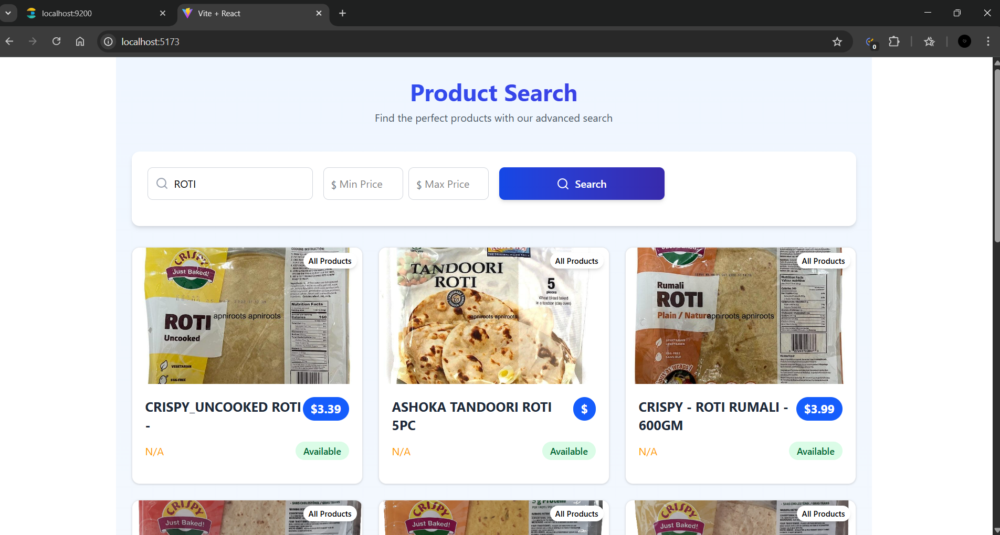

# 🛍️ E-commerce Product Crawler & Search UI

## 📖 Overview

This project is a full-stack solution that:

1. Crawls product listings from [ApniRoots](https://apniroots.com/),
2. Indexes the data into **Elasticsearch**, and
3. Provides a **searchable UI** built with **Flask** for querying and browsing products.

---

## 🚀 Features

- 🕷️ **Web crawler** to extract product details (name, price, description, rating, category, availability, image URL).
- 🔎 **Elasticsearch indexing** with full-text search and filter capabilities.
- 💻 **Search web UI** with:
  - Built using **React** (frontend)
  - Powered by **Flask** (backend)
  - Keyword search
  - Filters: category, price range, availability
  - Pagination
  - Product display with image, name, price, and rating

---

## 📦 Project Structure

```bash
.
├── crawler/                        # Web crawler for Apniroots
│   ├── crawl.py                    # Playwright-based async crawler script
│   └── Data/                       # Optional: stores raw JSON or temporary crawl files
│
├── ES/                             # Elasticsearch setup and utilities
│   └── elasticsearch_index.py      # Script to define index mapping and push data
│
├── Project/                        # Web application
│   ├── backend/                    # Flask API to serve search functionality
│   │   ├── app.py
│   │   └── requirements.txt        # Backend-specific dependencies
│   └── frontend/                   # React or other frontend framework UI
│       ├── src/
│       └── public/
│
├── apniroots_products.json         # Final output of scraped products
├── .gitignore                      # Git ignore file
└── README.md                       # Project documentation and setup guide

---

## ⚙️ Setup Instructions

### 1. Clone the Repository

```bash
git clone https://github.com/RudreshRaj001/apniroots-product-crawler.git
cd apniroots-product-crawler
```

### 2. Install Python Dependencies

```bash
python3 -m venv venv
source venv/bin/activate
pip install -r requirements.txt
```

Make sure [Playwright](https://playwright.dev/python/docs/intro) is also set up:

```bash
python -m playwright install
```

### 3. Start Elasticsearch

Ensure Elasticsearch is running locally at `http://localhost:9200`.
You can [install Elasticsearch manually](https://www.elastic.co/downloads/elasticsearch) and start it using:

```bash
./bin/elasticsearch
```

### 4. Run the Web Crawler

```bash
python crawler/crawl.py
```

This scrapes product data from [ApniRoots](https://apniroots.com/) and saves it to `apniroots_products.json`, then indexes it into Elasticsearch.

### 5. Start Flask API Server

```bash
cd Project/backend
python app.py
```

Server runs at: `http://localhost:5000`

### 6. Start React Frontend

In a new terminal:

```bash
cd Project/frontend
npm install
npm start
```

Frontend will run at: `http://localhost:3000`

---

## 🔍 Search API

API Endpoint: `/api/products`

### Query Parameters:

- `q` – Full-text search query  
- `category` – Filter by category  
- `availability` – Filter by availability (e.g., "In Stock")  
- `min_price` / `max_price` – Filter by price range  
- `skip` – Number of results to skip (for pagination)  
- `limit` – Number of results to return  

### Example:

```http
GET /api/products?q=basmati&category=Rice&min_price=5&max_price=15&skip=0&limit=10
```

---

## 🧪 Sample Queries

- Search: `http://localhost:5000/api/products?q=tea`
- Filter by category: `...&category=Beverages`
- Price range: `...&min_price=10&max_price=50`
- Pagination: `...&skip=10&limit=10`

---

## 📸 Screenshots and Video



- [Watch Video](https://www.youtube.com/watch?v=98mf6Y3uj2I)

---

## ✅ Deliverables

- ✅ Python crawler with JSON output  
- ✅ Elasticsearch setup with proper mappings  
- ✅ REST API and search UI  
- ✅ README with setup and sample queries  

---

## 🧑‍💻 Author

**Your Name**  
[GitHub](https://github.com/RudreshRaj001) | [LinkedIn](https://www.linkedin.com/in/rudreshraj/)

---
